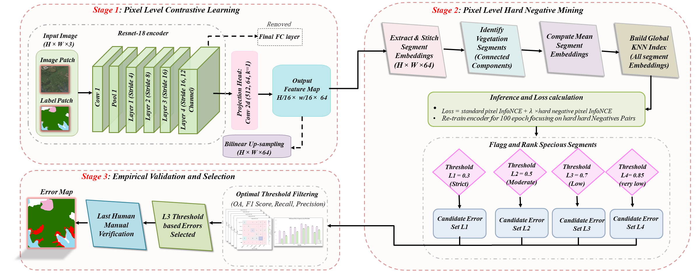

# VegeSSL

**Semi-Supervised Contrastive Learning for Vegetation Mislabel Detection in Remote Sensing Data**

[](https://www.python.org/downloads/)
[](https://pytorch.org/)
[](https://opensource.org/licenses/MIT)

VegeSSL is a multistage semi-supervised contrastive learning framework designed to identify noisy labels in vegetation classification data from remote sensing imagery. The method leverages pixel-level contrastive learning to learn discriminative representations, then uses segment-level isolation scores to detect potentially mislabeled regions.

## Overview



### Key Features

- **Pixel-level contrastive learning** using ResNet-18 encoder with InfoNCE loss
- **Hard negative mining** to refine embeddings for subtle class distinctions
- **Segment-level mislabel detection** based on embedding space isolation scores
- **Multi-threshold analysis** with configurable confidence levels
- **Publication-quality visualizations** for analysis and reporting

### Methodology

The pipeline consists of three stages:

1. **Stage 1 - Pixel-Level Contrastive Learning**: Train a ResNet-18 encoder using pixel-wise InfoNCE loss on vegetation pixels, learning representations where similar pixels are embedded closely together.

2. **Stage 2 - Hard Negative Mining**: Identify and emphasize hard negative pairs (pixels with similar embeddings but different labels) to refine the encoder's discriminative ability.

3. **Stage 3 - Segment-Level Mislabel Detection**: Extract connected component segments, compute mean embeddings, and calculate isolation scores based on neighbor label consistency. Segments with high isolation scores are flagged as potentially mislabeled.

## Installation

### Requirements

- Python 3.8+
- PyTorch 2.0+
- CUDA-capable GPU (recommended)

### Setup

```bash
# Clone the repository
git clone https://github.com/username/VegeSSL.git
cd VegeSSL

# Create virtual environment
python -m venv venv
source venv/bin/activate  # Linux/Mac
# or: venv\Scripts\activate  # Windows

# Install dependencies
pip install -r requirements.txt

# Optional: Install FAISS for faster KNN
pip install faiss-gpu  # For NVIDIA GPU
# or: pip install faiss-cpu  # For CPU only
```

## Quick Start

### 1. Prepare Your Data

Organize your data in the following structure:

```
data/
├── train/
│   ├── image/       # RGB images (.png)
│   └── label/       # Label images (.png, same filenames)
└── test/
    ├── image/
    └── label/
```

Label images should be RGB where each color corresponds to a class (see `configs/default.yaml`).

### 2. Configure Paths

Edit `configs/default.yaml` to set your data paths:

```yaml
data:
  train_image_path: "path/to/train/image"
  train_label_path: "path/to/train/label"
  test_image_path: "path/to/test/image"
  test_label_path: "path/to/test/label"
```

### 3. Run the Pipeline

```bash
# Run complete pipeline
python main.py --stage all
run individually. the structure and details of each folder
VegeSSL/
├── main.py                 # Entry point
├── requirements.txt        # Dependencies
├── LICENSE                 # MIT License
├── README.md              # This file
│
├── configs/               # Configuration
│   ├── __init__.py
│   ├── config.py          # Config loader
│   └── default.yaml       # Default settings
│
├── vegessl/               # Core library
│   ├── __init__.py
│   ├── models.py          # Neural network architectures
│   ├── losses.py          # Loss functions
│   ├── datasets.py        # Data loading
│   └── utils.py           # Utility functions
│
├── experiments/           # Training scripts
│   ├── __init__.py
│   ├── train_stage1.py    # Stage 1 training
│   └── train_stage2.py    # Stage 2 training
│
├── evaluation/            # Evaluation scripts
│   ├── __init__.py
│   ├── detect_errors.py   # Mislabel detection
│   └── visualize.py       # Visualization

```

### 4. Review Results

Results are saved to the `output/` directory:

```
output/
├── checkpoints/        # Model weights
├── tables/            # CSV files with detection results
│   ├── all_segments_analysis.csv
│   ├── suspicious_low.csv
│   ├── suspicious_medium.csv
│   ├── suspicious_high.csv
│   └── suspicious_very_high.csv
└── figures/           # Visualization plots
```

### Python API

```python
from vegessl import PixelContrastiveEncoder, ContrastiveCropDataset
from vegessl.utils import extract_segments, compute_isolation_scores

# Load trained model
model = PixelContrastiveEncoder(embedding_dim=128)
model.load_state_dict(torch.load("output/checkpoints/refined_pixel_encoder.pt")['model_state_dict'])

# Extract segments from an image
segments = extract_segments(class_mask, min_segment_size=10)

# Use the model for embedding extraction
with torch.no_grad():
    embeddings = model(image_tensor, upsample=True)
```

## Configuration

The configuration file (`configs/default.yaml`) controls all aspects of the pipeline:

### Key Parameters

| Parameter | Default | Description |
|-----------|---------|-------------|
| `training.batch_size` | 4 | Training batch size |
| `training.crop_size` | 512 | Size of random crops |
| `training.embedding_dim` | 128 | Embedding dimension |
| `training.temperature` | 0.05 | InfoNCE temperature |
| `training.stage1.epochs` | 100 | Stage 1 training epochs |
| `training.stage2.epochs` | 100 | Stage 2 training epochs |
| `detection.knn_neighbors` | 50 | Neighbors for isolation score |

### Detection Thresholds

Four threshold levels are provided for mislabel detection:

| Level | Name | Threshold | Description |
|-------|------|-----------|-------------|
| 1 | Low | 0.3 | Many detections, lower precision |
| 2 | Medium | 0.5 | Balanced precision/recall |
| 3 | High | 0.7 | Fewer false positives |
| 4 | Very High | 0.85 | Only strong anomalies |


If you use VegeSSL in your research, please cite:

```bibtex

```

## Contributing

Contributions are welcome! Please feel free to submit a Pull Request. For major changes, please open an issue first to discuss what you would like to change.

1. Fork the repository
2. Create your feature branch (`git checkout -b feature/AmazingFeature`)
3. Commit your changes (`git commit -m 'Add some AmazingFeature'`)
4. Push to the branch (`git push origin feature/AmazingFeature`)
5. Open a Pull Request

## License

This project is licensed under the MIT License - see the [LICENSE](LICENSE) file for details.

## Acknowledgments

- ResNet architecture from [torchvision](https://pytorch.org/vision/stable/index.html)
- InfoNCE loss inspired by [SimCLR](https://arxiv.org/abs/2002.05709)
- FAISS for efficient similarity search
